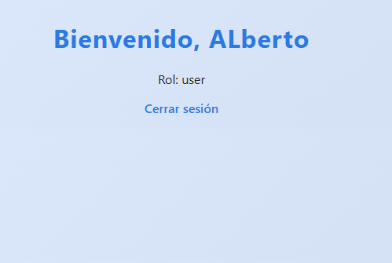
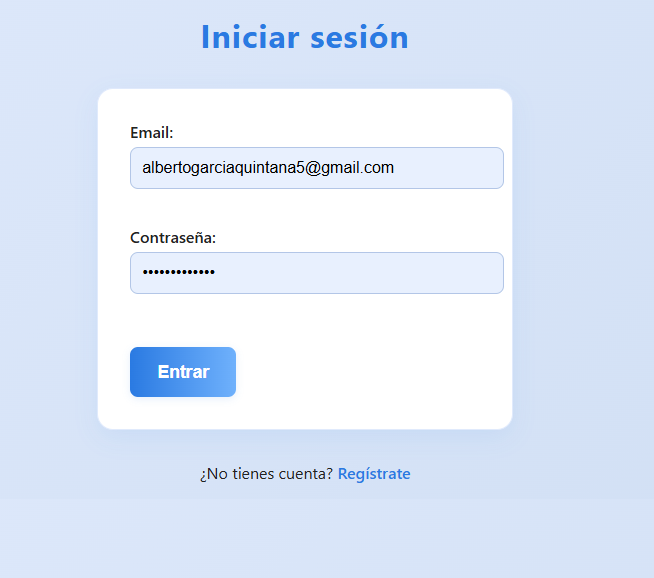
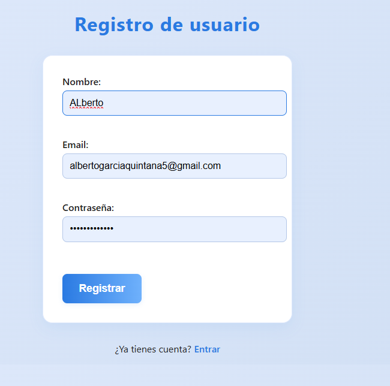

<div align="center">
  <h1>🔐 Login MVC en PHP + PDO</h1>
  
</div>

Proyecto ejemplo: implementación simple y segura de un sistema de login usando arquitectura MVC, PDO y buenas prácticas.

---

## 🚀 Características
- Arquitectura MVC clara y sencilla
- Uso de PDO y sentencias preparadas para máxima seguridad
- Contraseñas cifradas con `password_hash()`
- Código comentado y fácil de entender
- Vistas separadas para login, registro y dashboard

## 📦 Requisitos
- PHP 8.0+
- Extensión PDO (pdo_mysql)
- MySQL / MariaDB
- Servidor web local (XAMPP recomendado)

## ⚡ Instalación rápida
1. Clona o copia este proyecto en `xampp/htdocs/` (por ejemplo: `htdocs/dwes-login-mvc`).
2. Crea la base de datos ejecutando el SQL de `sql/schema.sql` (puedes usar phpMyAdmin o consola):
   ```sql
   CREATE DATABASE loginmvc CHARACTER SET utf8mb4 COLLATE utf8mb4_unicode_ci;
   USE loginmvc;
   -- luego importa el archivo sql/schema.sql
   ```
3. Configura la conexión en `config/database.php` si es necesario.
4. Accede desde tu navegador: `http://localhost/dwes-login-mvc/public/`

## 🖼️ Capturas de pantalla

### Pantalla de inicio
Visualización tras iniciar sesión correctamente, mostrando el dashboard del usuario autenticado.


### Login
Formulario para que los usuarios registrados accedan al sistema de forma segura.


### Registro
Formulario para crear una nueva cuenta de usuario, solicitando nombre, email y contraseña.


## 🛡️ Seguridad
- Contraseñas cifradas con `password_hash()` y verificadas con `password_verify()`
- Uso de sentencias preparadas para evitar inyecciones SQL
- Validaciones básicas en el backend
- Recomendado usar HTTPS en producción

## 📁 Estructura del proyecto
```
dwes-login-mvc/
├── app/
│   ├── controllers/
│   ├── models/
│   └── views/
├── config/
├── public/
│   └── style.css
├── sql/
│   └── schema.sql
├── inicio.png
├── login.png
├── registro-para-login.png
└── README.md
```

## 👤 Autor
Alberto García Quintana

---
¡Si te resulta útil, deja una estrella en el repo!
